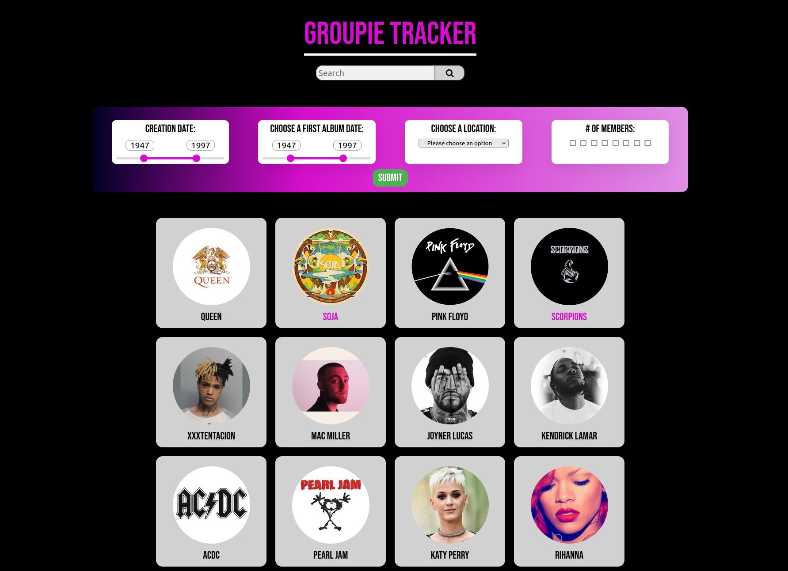

# Groupie Tracker 


The project consists on receiving a given API and manipulate the data contained in it, in order to create a site, displaying the information. This project also focuses on the creation of events and on their visualization. 

- Technical Stack: Golang, HTML/CSS, Javascript

- The website is using an [API](https://groupietrackers.herokuapp.com/api), that consists in four parts:

    - The first one, `artists`, containing information about some bands and artists like their name(s), image, in which year they began their activity, the date of their first album and the members.

    - The second one, `locations`, consists in their last and/or upcoming concert locations.

    - The third one, `dates`, consists in their last and/or upcoming concert dates.

    - And the last one, `relation`, does the link between all the other parts, `artists`, `dates` and `locations`.

- Given all this I have built a user friendly website where the bands info displayed.

## How to run

```shell
$ cd groupie-tracker/
$ go run /cmd/main.go
2023/02/26 13:55:49 Запуск сервера на http://127.0.0.1:4000
...
```
Follow the link [http://127.0.0.1:4000](http://127.0.0.1:4000)